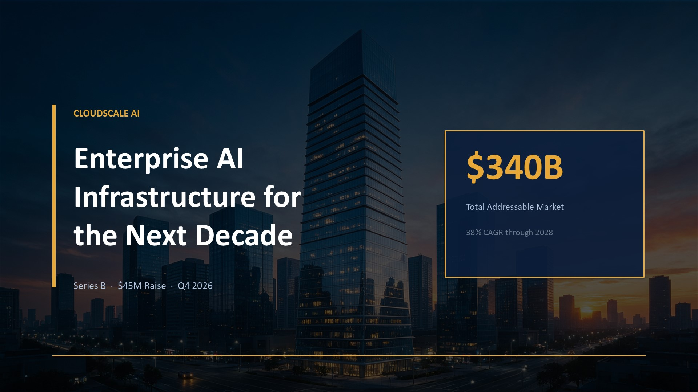
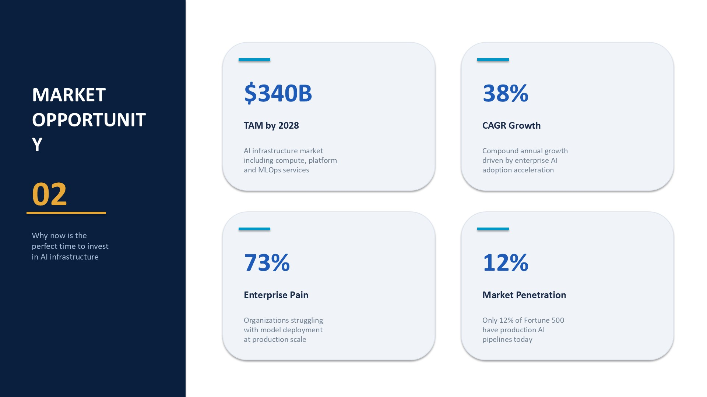
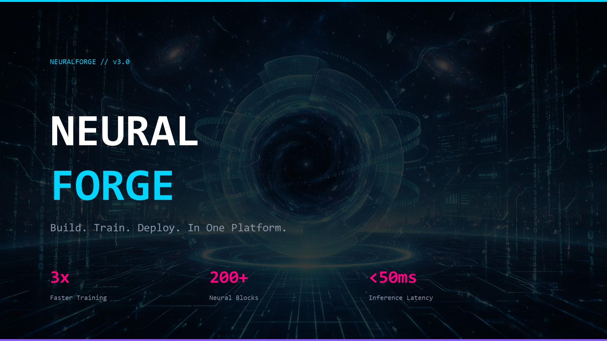
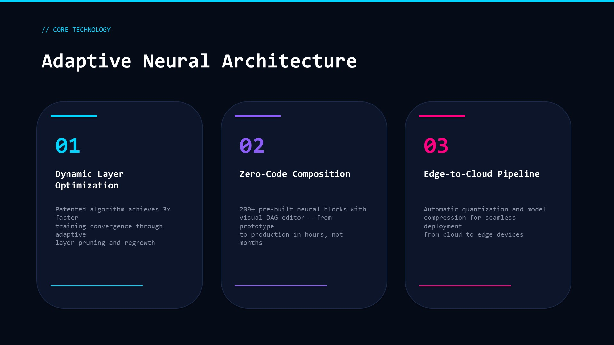
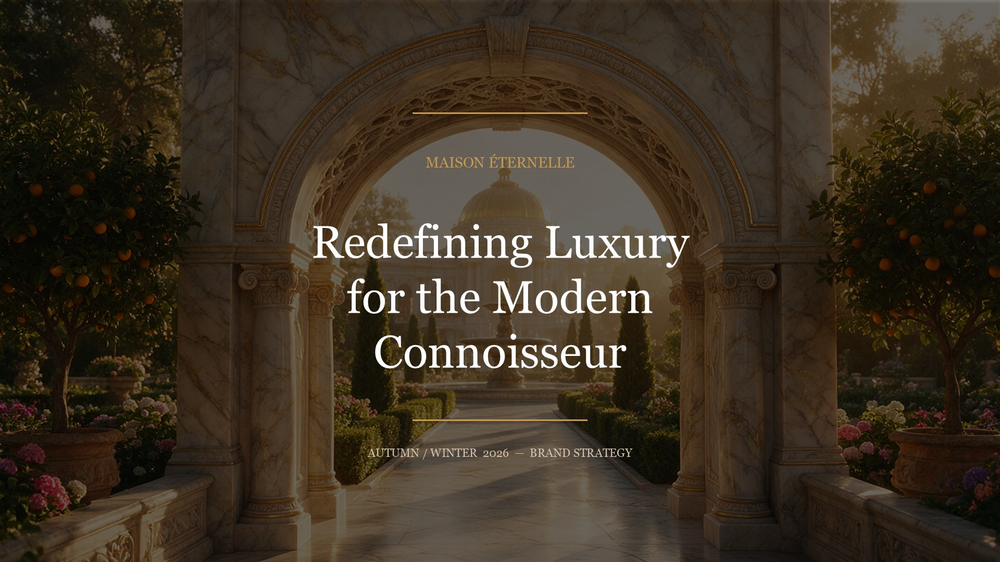
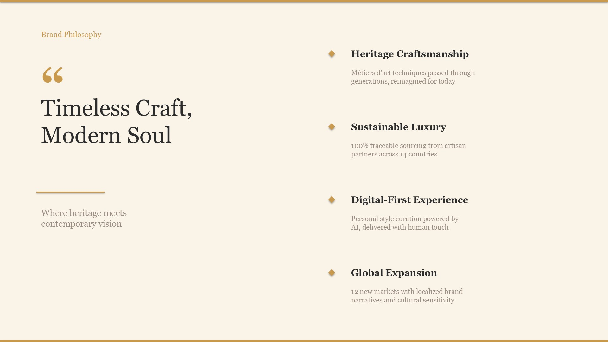
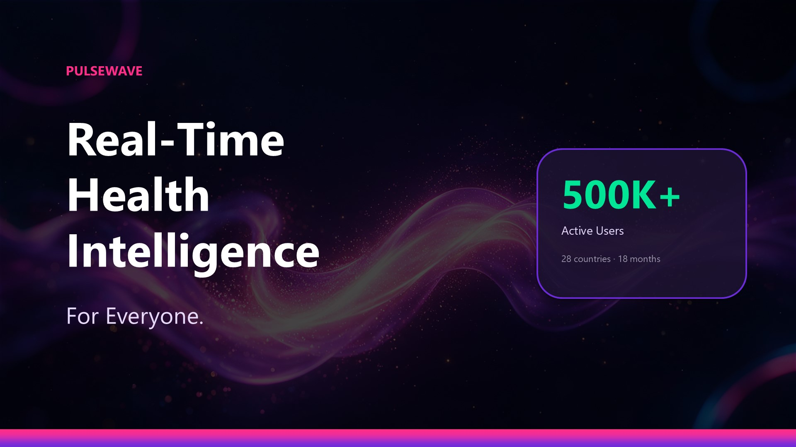
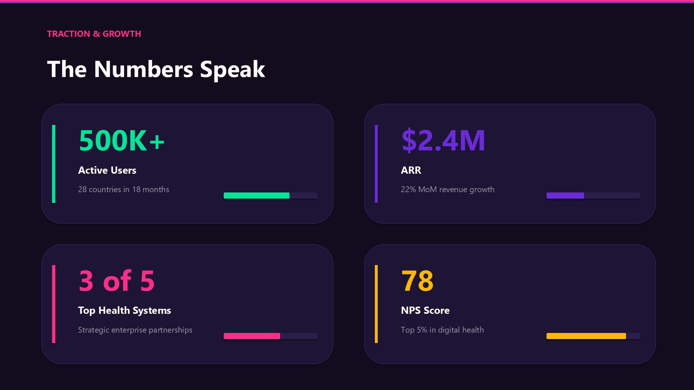
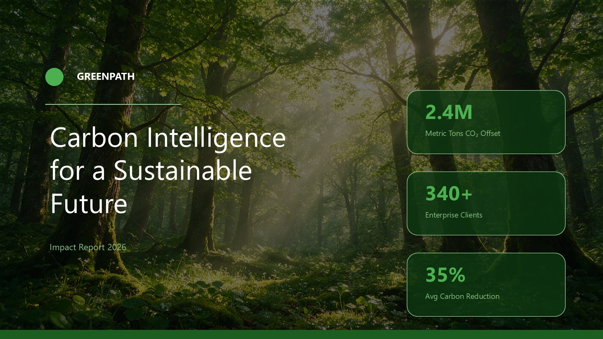
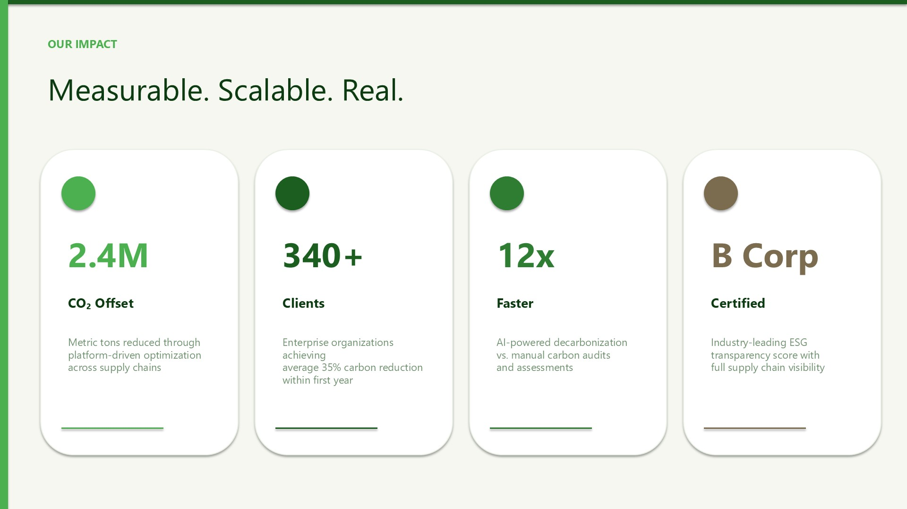

<div align="center">

# PPT Design Skill

**一句话生成专业级 .pptx 演示文稿**

叙事驱动 · 设计智能 · AI配图 · 完全可编辑 · **40,000+ 风格组合**

[](LICENSE)
[](https://python.org)
[](https://pypi.org/project/python-pptx/)

适配 OpenCode · Claude Code · Codex · Cursor

[English](#english) | 中文

</div>

---

## ✨ 案例展示

> 5 种风格，5 种场景 — 每个案例包含封面 + 内容页，AI 配图由 Seedream Pro 生成

### 🏢 Professional Modern — 企业融资路演

 

*深蓝商务风 · 金色点缀 · 左侧导航栏 · 四宫格数据卡片*

### 🌌 Dark Tech — 科技产品发布

 

*赛博朋克风 · 霓虹蓝紫粉 · Consolas 等宽字体 · 三列特性卡片*

### 🏛️ Warm Elegant — 奢侈品牌策略

 

*金色大理石风 · Georgia 衬线字体 · 居中编辑式排版 · 菱形装饰符*

### 🚀 Vibrant Startup — 创业融资路演

 

*紫粉渐变风 · Segoe UI · 进度条数据可视化 · 半透明统计胶囊*

### 🌿 Nature Calm — 可持续发展报告

 

*森林绿风 · 圆形装饰符 · 四列影响卡片 · 左侧窄边栏*

---

## 🔥 核心特性

| 特性 | 说明 |
|------|------|
| **叙事引擎** | 3 种策略（YC Seed Deck / Product Demo / Sales Pitch）+ Duarte Sparkline 情绪弧线 |
| **设计智能** | 复用 ui-ux-pro-max 5100+ 条设计知识库，上下文感知布局/色彩/字体 |
| **40,000+ 风格组合** | 25 色彩方案 × 20 字体搭配 × 10 装饰风格 × 8 布局变体 = 无限可能 |
| **自然语言风格** | 描述风格即生成：`--style "warm fintech"` / `--style "dark cyberpunk"` |
| **python-pptx 直出** | 完全可编辑 .pptx，356x 快于 HTML→截图方案 |
| **12 母版布局** | 13.333"×7.5" 16:9 精确坐标，覆盖 95% 演示场景 |
| **9 种文案公式** | PAS / FAB / AIDA / Social Proof / Cost of Inaction / Proof Stack... |
| **5 套预置主题** | Professional / Dark Tech / Warm Elegant / Vibrant Startup / Nature Calm |
| **AI 智能配图** | Seedream / GPT Image / DALL-E / Wanx / Kimi K2.6 — 5 种图片引擎 |
| **设计拨盘** | variance / motion / density 三维调控 |
| **CJK 字体** | 东亚字体自动回退链（Microsoft YaHei / STSong） |
| **QA 门禁** | 5 项自动质量检查（页数/标题/字号/一致性/占位符） |

---

## 🚀 快速开始

### 安装

```bash
pip install -e .
# 可选：搜索引擎支持
pip install -e ".[search]"
```

### CLI

```bash
# 一句话生成 PPT
ppt-design "AI产品融资路演"

# 自然语言风格 — 无限组合！
ppt-design "AI产品融资路演" --style "warm fintech pitch"
ppt-design "科技产品发布" --style "dark cyberpunk tech"
ppt-design "品牌策略" --style "elegant luxury"
ppt-design "可持续发展报告" --style "calm nature"

# 精确控制设计原子
ppt-design "融资路演" --palette wine-burgundy --fonts elegant-serif --decoration gold-trim --layout-variant centered

# 指定策略和主题（向后兼容）
ppt-design "SaaS产品展示" --strategy "Product Demo" --theme "dark-tech"

# AI 生成配图（Seedream Pro）
ppt-design "融资路演" --fetch-images --llm-provider seedream --llm-api-key YOUR_ARK_KEY

# AI 生成配图（GPT Image）
ppt-design "产品介绍" --fetch-images --llm-provider gpt-image --llm-api-key sk-xxx

# Kimi K2.6 增强搜索关键词 → 自动下载高质量图片
ppt-design "融资路演" --image-mode enhance --llm-provider kimi --llm-api-key sk-xxx

# 从 JSON 文件读取真实内容
ppt-design "融资路演" --content pitch-data.json

# 设计拨盘
ppt-design "融资路演" --variance 8 --motion 6 --density 7

# 仅输出设计决策（调试）
ppt-design "融资路演" --dry-run
```

### Python API

```python
from ppt_pro_max import generate_ppt

# 最简用法
result = generate_ppt("AI产品融资路演")
print(f"生成: {result['output_path']}, {result['page_count']}页")

# 自然语言风格 — 无限组合
result = generate_ppt("AI产品融资路演", style="warm fintech pitch")
result = generate_ppt("科技产品发布", style="dark cyberpunk")
result = generate_ppt("品牌策略", style="elegant luxury minimal")

# 精确控制设计原子
result = generate_ppt(
    query="AI产品融资路演",
    palette="wine-burgundy",
    fonts="elegant-serif",
    decoration="gold-trim",
    layout_variant="centered",
)

# 完整配置 — AI 配图 + 风格组合
result = generate_ppt(
    query="AI产品融资路演",
    strategy="YC Seed Deck",
    theme="dark-tech",
    slides=12,
    fetch_images=True,
    llm_provider="seedream",
    llm_api_key="ark-xxx",
    llm_model="doubao-seedream-5-0-pro-260628",
    variance=7,
    motion=5,
    density=6,
    output="my-pitch.pptx",
)
```

### 内容 JSON 格式

```json
{
  "company": "Acme AI",
  "product": "AI Marketing Platform",
  "tagline": "Your AI marketing team. Always on.",
  "metrics": {"users": "10K+", "retention": "95%", "growth": "3x", "arr": "$2M"},
  "pain_points": [
    {"title": "Content Overload", "desc": "Need 10x content with same headcount"},
    {"title": "Tool Fatigue", "desc": "15+ tools that don't talk to each other"}
  ],
  "chart_data": {
    "mrr": {"labels": ["Sep","Oct","Nov","Dec"], "values": [5,12,28,45]}
  }
}
```

---

## 🏗️ 四层架构

```
用户输入 → Phase 1: 叙事规划 → Phase 2: 设计决策 → Phase 3: 内容生成 → Phase 4: PPT渲染 → .pptx
                  ↓                  ↓                  ↓                  ↓
           story_planner      design_decider     content_generator     ppt_renderer
           (策略+情绪弧线)    (布局+色彩+字体)    (文案公式+图片)       (python-pptx直出)
```

| 层 | 模块 | 职责 |
|----|------|------|
| 叙事层 | `planner/story_planner.py` | 策略选择 → 页面结构 → 情绪弧线 → Duarte Sparkline |
| 设计层 | `decider/design_decider.py` | 布局选择 → 色彩处理 → 排版规格 → 图表类型 → 过渡选择 |
| 内容层 | `content/content_generator.py` | 文案公式 → 数据配置 → 图片关键词 → 模板变量填充 |
| 表达层 | `renderer/ppt_renderer.py` | 主题映射 → 12母版布局 → 图表渲染 → 图片插入 → 动画过渡 → QA检查 |

---

## 🖼️ 图片引擎

| 引擎 | 类型 | CLI 参数 | 说明 |
|------|------|----------|------|
| `placeholder` | 占位符 | 默认 | 渐变占位图，无需 API |
| `search` | 搜索下载 | `--image-mode search` | Unsplash / Pexels |
| `seedream` | AI 生成 | `--llm-provider seedream` | 字节豆包 Seedream Pro（推荐） |
| `gpt-image` | AI 生成 | `--llm-provider gpt-image` | OpenAI GPT Image |
| `dalle` | AI 生成 | `--llm-provider dalle` | OpenAI DALL-E 3 |
| `wanx` | AI 生成 | `--llm-provider wanx` | 阿里通义万相 |
| `kimi` | 增强搜索 | `--llm-provider kimi` | Kimi K2.6 优化关键词 → 搜索下载 |

所有 AI 生成引擎均内置 **缓存优先** 机制 — 相同图片绝不重复调用 API，节省成本。

---

## 🎨 设计原子 — 40,000+ 风格组合

> 5 套预置主题只是冰山一角。通过组合 4 类设计原子，实现无限风格：

| 设计原子 | 数量 | 示例 |
|----------|------|------|
| 🎨 色彩方案 | 25 | ocean-blue, cyber-neon, golden-luxury, wine-burgundy, terracotta, monochrome-dark... |
| ✏️ 字体搭配 | 20 | modern-sans, serif-editorial, tech-mono, elegant-serif, bold-sans, contrast-mix... |
| 🖌️ 装饰风格 | 10 | accent-bar, neon-lines, gold-trim, diamond-bullets, gradient-bar, circle-accent, sidebar-nav... |
| 📐 布局变体 | 8 | standard, centered, sidebar-left, sidebar-right, grid-2x2, wide-cards, asymmetric, full-width |

**25 × 20 × 10 × 8 = 40,000 种组合** — 还不算自然语言风格的模糊匹配！

### 自然语言风格

```bash
ppt-design "融资路演" --style "warm fintech"        # 自动匹配: ocean-blue + clean-corporate + accent-bar + sidebar-left
ppt-design "产品发布" --style "dark cyberpunk"       # 自动匹配: cyber-neon + tech-mono + neon-lines + wide-cards
ppt-design "品牌策略" --style "elegant luxury"       # 自动匹配: golden-luxury + elegant-serif + gold-trim + centered
ppt-design "ESG报告" --style "calm nature"           # 自动匹配: sage-calm + humanist-sans + circle-accent + standard
ppt-design "创业路演" --style "bold startup vibrant"  # 自动匹配: royal-purple + bold-sans + gradient-bar + grid-2x2
```

### 精确原子控制

```bash
ppt-design "融资路演" --palette wine-burgundy --fonts elegant-serif --decoration gold-trim --layout-variant centered
ppt-design "产品发布" --palette copper-industrial --fonts tech-contrast --decoration no-decoration --layout-variant full-width
```

### 5 套预置主题（向后兼容）

| 主题 | 色彩 | 字体 | 装饰 | 布局 |
|------|------|------|------|------|
| Professional | midnight-navy | clean-corporate | accent-bar | sidebar-left |
| Dark Tech | cyber-neon | tech-mono | neon-lines | wide-cards |
| Warm Elegant | golden-luxury | serif-editorial | gold-trim | centered |
| Vibrant Startup | neon-gradient | bold-sans | gradient-bar | grid-2x2 |
| Nature Calm | forest-green | humanist-sans | circle-accent | sidebar-left |

---

## 🔗 与 ui-ux-pro-max 的关系

**独立仓库 + 依赖引用**模式：

- **调用** ui-ux-pro-max 的搜索引擎和设计知识库（5100+ 条 CSV）
- **不修改** ui-ux-pro-max 的任何代码
- **新增** PPT 专属代码和数据
- 通过**适配层**隔离上游 API 变更

---

## 📁 项目结构

```
PPT-Design-Skill/
├── pyproject.toml
├── SKILL.md                          # AI skill 定义
├── docs/showcase/                    # 案例截图
├── src/ppt_pro_max/
│   ├── __init__.py                   # generate_ppt() API
│   ├── cli.py                        # ppt-design CLI
│   ├── adapters/                     # 适配层
│   │   ├── ui_ux_adapter.py          # ui-ux-pro-max 适配
│   │   └── slide_search_adapter.py   # slide_search 适配
│   ├── planner/story_planner.py      # Phase 1: 叙事规划
│   ├── decider/design_decider.py     # Phase 2: 设计决策
│   ├── content/content_generator.py  # Phase 3: 内容生成
│   ├── renderer/
│   │   ├── ppt_renderer.py           # Phase 4: PPT 渲染
│   │   ├── theme_mapper.py           # 主题映射 + CJK 字体
│   │   ├── layout_registry.py        # 12 母版布局
│   │   ├── chart_builder.py          # 图表构建器
│   │   ├── image_fetcher.py          # 图片获取（5种引擎）
│   │   └── effects.py               # 阴影/辉光/渐变
│   └── qa/qa_gates.py               # 5项质量检查
├── data/ppt/                         # PPT 专属数据
├── examples/                         # 案例 PPT
└── tests/                            # 47 个测试
```

## License

MIT

---

<a id="english"></a>

# PPT Design Skill

**Generate professional .pptx presentations from a single sentence**

Narrative-driven · Design-intelligent · AI images · Fully editable

Compatible with OpenCode · Claude Code · Codex · Cursor

---

## ✨ Showcase

> 5 styles, 5 scenarios — each with cover + content page, AI images by Seedream Pro

### 🏢 Professional Modern — Enterprise Investor Pitch

 

*Navy blue corporate · Gold accents · Left sidebar navigation · 2×2 metric cards*

### 🌌 Dark Tech — AI Product Launch

 

*Cyberpunk dark · Neon blue/purple/pink · Consolas monospace · 3-column feature cards*

### 🏛️ Warm Elegant — Luxury Brand Strategy

 

*Golden marble · Georgia serif · Centered editorial layout · Diamond bullet points*

### 🚀 Vibrant Startup — Fundraising Pitch Deck

 

*Purple-pink gradient · Segoe UI · Progress bar metrics · Semi-transparent stat pills*

### 🌿 Nature Calm — Sustainability Impact Report

 

*Forest green · Circle accents · 4-column impact cards · Narrow left sidebar*

---

## 🔥 Features

| Feature | Description |
|---------|-------------|
| **Narrative Engine** | 3 strategies (YC Seed Deck / Product Demo / Sales Pitch) + Duarte Sparkline emotion arcs |
| **Design Intelligence** | Reuses ui-ux-pro-max 5100+ design knowledge base for context-aware decisions |
| **40,000+ Style Combos** | 25 palettes × 20 font pairs × 10 decorations × 8 layout variants |
| **Natural Language Style** | Describe your style: `--style "warm fintech"` / `--style "dark cyberpunk"` |
| **python-pptx Direct** | Fully editable .pptx output, 356x faster than HTML→screenshot |
| **12 Master Layouts** | 13.333"×7.5" 16:9 precise coordinates, covering 95% of scenarios |
| **9 Copy Formulas** | PAS / FAB / FAB / AIDA / Social Proof / Cost of Inaction / Proof Stack... |
| **5 Preset Themes** | Professional / Dark Tech / Warm Elegant / Vibrant Startup / Nature Calm |
| **AI Image Engines** | Seedream / GPT Image / DALL-E / Wanx / Kimi K2.6 — 5 engines |
| **Design Dials** | variance / motion / density 3-axis control |
| **CJK Fonts** | East Asian font fallback chain (Microsoft YaHei / STSong) |
| **QA Gates** | 5 automated quality checks (pages / titles / fonts / consistency / placeholders) |

---

## 🚀 Quick Start

### Install

```bash
pip install -e .
# Optional: search engine support
pip install -e ".[search]"
```

### CLI

```bash
# Generate PPT from a single sentence
ppt-design "AI startup investor pitch"

# Specify strategy and theme
ppt-design "SaaS product demo" --strategy "Product Demo" --theme "dark-tech"

# AI-generated images (Seedream Pro)
ppt-design "investor pitch" --fetch-images --llm-provider seedream --llm-api-key YOUR_ARK_KEY

# AI-generated images (GPT Image)
ppt-design "product intro" --fetch-images --llm-provider gpt-image --llm-api-key sk-xxx

# Kimi K2.6 enhances search keywords → downloads high-quality images
ppt-design "investor pitch" --image-mode enhance --llm-provider kimi --llm-api-key sk-xxx

# Load real content from JSON
ppt-design "investor pitch" --content pitch-data.json

# Design dials
ppt-design "investor pitch" --variance 8 --motion 6 --density 7

# Dry-run (design decisions only)
ppt-design "investor pitch" --dry-run
```

### Python API

```python
from ppt_pro_max import generate_ppt

# Minimal usage
result = generate_ppt("AI startup investor pitch")
print(f"Generated: {result['output_path']}, {result['page_count']} pages")

# Full configuration — AI images
result = generate_ppt(
    query="AI startup investor pitch",
    strategy="YC Seed Deck",
    theme="dark-tech",
    slides=12,
    fetch_images=True,
    llm_provider="seedream",
    llm_api_key="ark-xxx",
    llm_model="doubao-seedream-5-0-pro-260628",
    variance=7,
    motion=5,
    density=6,
    output="my-pitch.pptx",
)
```

### Content JSON Format

```json
{
  "company": "Acme AI",
  "product": "AI Marketing Platform",
  "tagline": "Your AI marketing team. Always on.",
  "metrics": {"users": "10K+", "retention": "95%", "growth": "3x", "arr": "$2M"},
  "pain_points": [
    {"title": "Content Overload", "desc": "Need 10x content with same headcount"},
    {"title": "Tool Fatigue", "desc": "15+ tools that don't talk to each other"}
  ],
  "chart_data": {
    "mrr": {"labels": ["Sep","Oct","Nov","Dec"], "values": [5,12,28,45]}
  }
}
```

---

## 🏗️ 4-Layer Architecture

```
Input → Phase 1: Story Planning → Phase 2: Design Decisions → Phase 3: Content Generation → Phase 4: PPT Rendering → .pptx
               ↓                        ↓                          ↓                           ↓
        story_planner            design_decider            content_generator            ppt_renderer
        (strategy+emotion arc)  (layout+color+typography) (copy formulas+images)      (python-pptx direct)
```

| Layer | Module | Responsibility |
|-------|--------|----------------|
| Narrative | `planner/story_planner.py` | Strategy → Page structure → Emotion arc → Duarte Sparkline |
| Design | `decider/design_decider.py` | Layout → Color → Typography → Chart type → Transitions |
| Content | `content/content_generator.py` | Copy formulas → Data config → Image keywords → Variable filling |
| Expression | `renderer/ppt_renderer.py` | Theme → 12 layouts → Charts → Images → Animations → QA |

---

## 🖼️ Image Engines

| Engine | Type | CLI | Notes |
|--------|------|-----|-------|
| `placeholder` | Gradient placeholder | Default | No API key needed |
| `search` | Unsplash / Pexels | `--image-mode search` | API key required |
| `seedream` | AI generate | `--llm-provider seedream` | ByteDance Seedream Pro (recommended) |
| `gpt-image` | AI generate | `--llm-provider gpt-image` | OpenAI GPT Image |
| `dalle` | AI generate | `--llm-provider dalle` | OpenAI DALL-E 3 |
| `wanx` | AI generate | `--llm-provider wanx` | Alibaba Wanx |
| `kimi` | Enhanced search | `--llm-provider kimi` | Kimi K2.6 keyword optimization → search |

All AI generation engines include **cache-first** — same image never generated twice, saving costs.

---

## 🎨 Design Atoms — 40,000+ Style Combinations

> 5 presets are just the tip of the iceberg. Compose 4 atom types for infinite styles:

| Atom | Count | Examples |
|------|-------|----------|
| 🎨 Color Palettes | 25 | ocean-blue, cyber-neon, golden-luxury, wine-burgundy, terracotta, monochrome-dark... |
| ✏️ Font Pairs | 20 | modern-sans, serif-editorial, tech-mono, elegant-serif, bold-sans, contrast-mix... |
| 🖌️ Decorations | 10 | accent-bar, neon-lines, gold-trim, diamond-bullets, gradient-bar, circle-accent, sidebar-nav... |
| 📐 Layout Variants | 8 | standard, centered, sidebar-left, sidebar-right, grid-2x2, wide-cards, asymmetric, full-width |

**25 × 20 × 10 × 8 = 40,000 combinations** — plus fuzzy natural language matching!

### Natural Language Style

```bash
ppt-design "investor pitch" --style "warm fintech"        # → ocean-blue + clean-corporate + accent-bar + sidebar-left
ppt-design "product launch" --style "dark cyberpunk"      # → cyber-neon + tech-mono + neon-lines + wide-cards
ppt-design "brand strategy" --style "elegant luxury"      # → golden-luxury + elegant-serif + gold-trim + centered
ppt-design "ESG report" --style "calm nature"             # → sage-calm + humanist-sans + circle-accent + standard
ppt-design "startup pitch" --style "bold startup vibrant"  # → royal-purple + bold-sans + gradient-bar + grid-2x2
```

### Exact Atom Control

```bash
ppt-design "pitch" --palette wine-burgundy --fonts elegant-serif --decoration gold-trim --layout-variant centered
ppt-design "launch" --palette copper-industrial --fonts tech-contrast --decoration no-decoration --layout-variant full-width
```

### 5 Preset Themes (backward compatible)

| Theme | Palette | Fonts | Decoration | Layout |
|-------|---------|-------|------------|--------|
| Professional | midnight-navy | clean-corporate | accent-bar | sidebar-left |
| Dark Tech | cyber-neon | tech-mono | neon-lines | wide-cards |
| Warm Elegant | golden-luxury | serif-editorial | gold-trim | centered |
| Vibrant Startup | neon-gradient | bold-sans | gradient-bar | grid-2x2 |
| Nature Calm | forest-green | humanist-sans | circle-accent | sidebar-left |

---

## 🔗 Relationship with ui-ux-pro-max

**Independent repo + dependency reference** model:

- **Calls** ui-ux-pro-max's search engine and design knowledge base (5100+ CSV entries)
- **Does NOT modify** any ui-ux-pro-max code
- **Adds** PPT-specific code and data
- **Adapter layer** isolates upstream API changes

---

## 📁 Project Structure

```
PPT-Design-Skill/
├── pyproject.toml
├── SKILL.md                          # AI skill definition
├── docs/showcase/                    # Showcase screenshots
├── src/ppt_pro_max/
│   ├── __init__.py                   # generate_ppt() API
│   ├── cli.py                        # ppt-design CLI
│   ├── adapters/                     # Adapter layer
│   │   ├── ui_ux_adapter.py          # ui-ux-pro-max adapter
│   │   └── slide_search_adapter.py   # slide_search adapter
│   ├── planner/story_planner.py      # Phase 1: Story planning
│   ├── decider/design_decider.py     # Phase 2: Design decisions
│   ├── content/content_generator.py  # Phase 3: Content generation
│   ├── renderer/
│   │   ├── ppt_renderer.py           # Phase 4: PPT rendering
│   │   ├── theme_mapper.py           # Theme mapping + CJK fonts
│   │   ├── theme_composer.py         # 40,000+ style combinations
│   │   ├── layout_registry.py        # 12 master layouts
│   │   ├── chart_builder.py          # Chart builder
│   │   ├── image_fetcher.py          # Image fetching (5 engines)
│   │   └── effects.py               # Shadow/glow/gradient
│   └── qa/qa_gates.py               # 5 quality checks
├── data/ppt/                         # PPT-specific data
├── examples/                         # Showcase PPTs
└── tests/                            # 47 tests
```

## License

MIT
