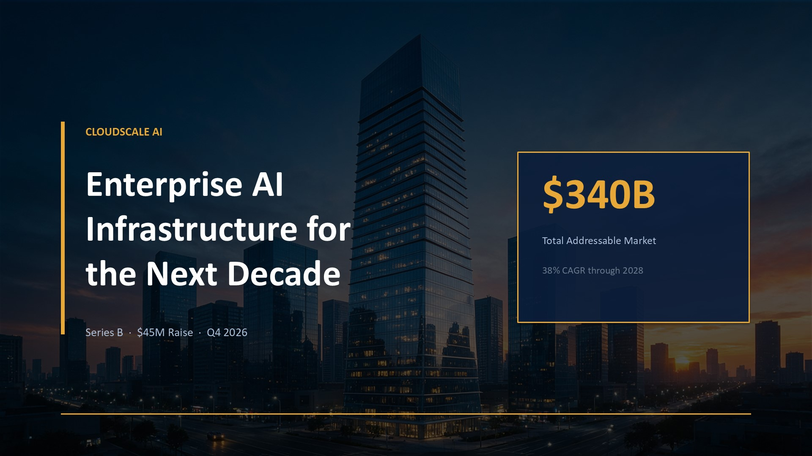
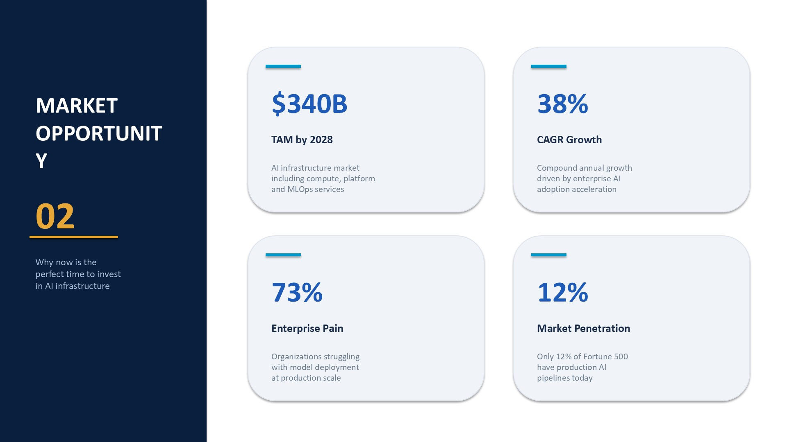
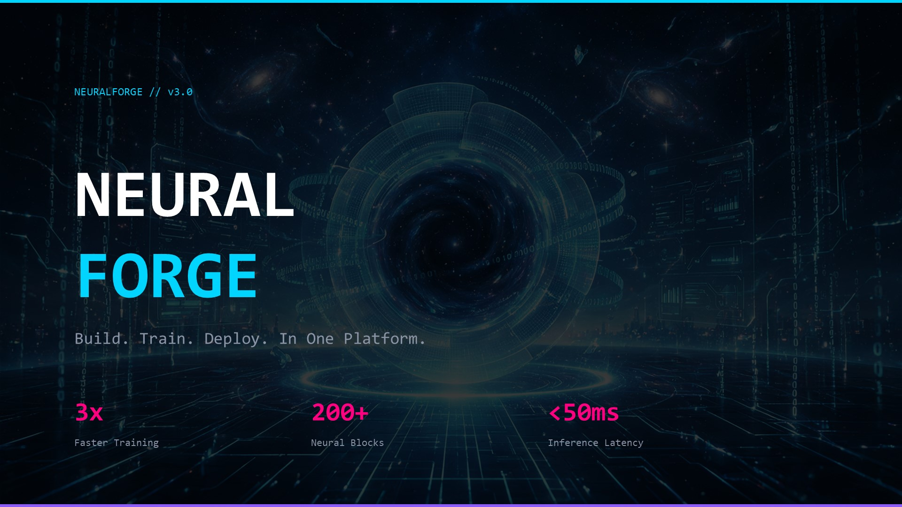
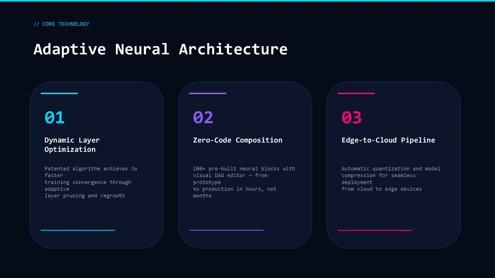
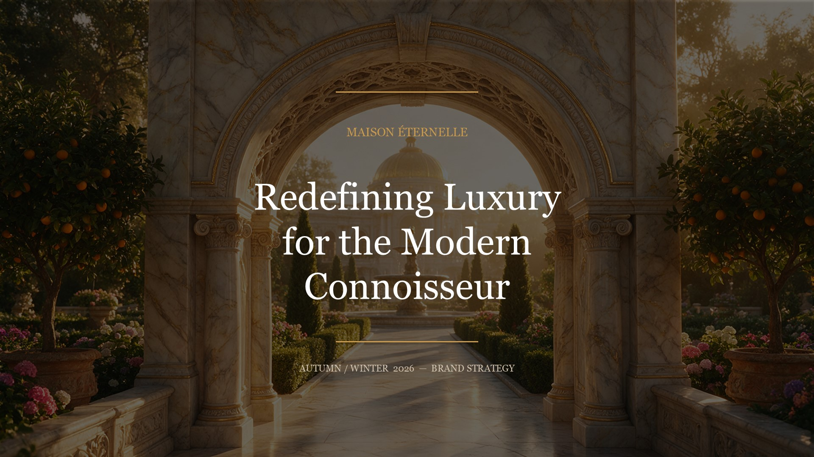
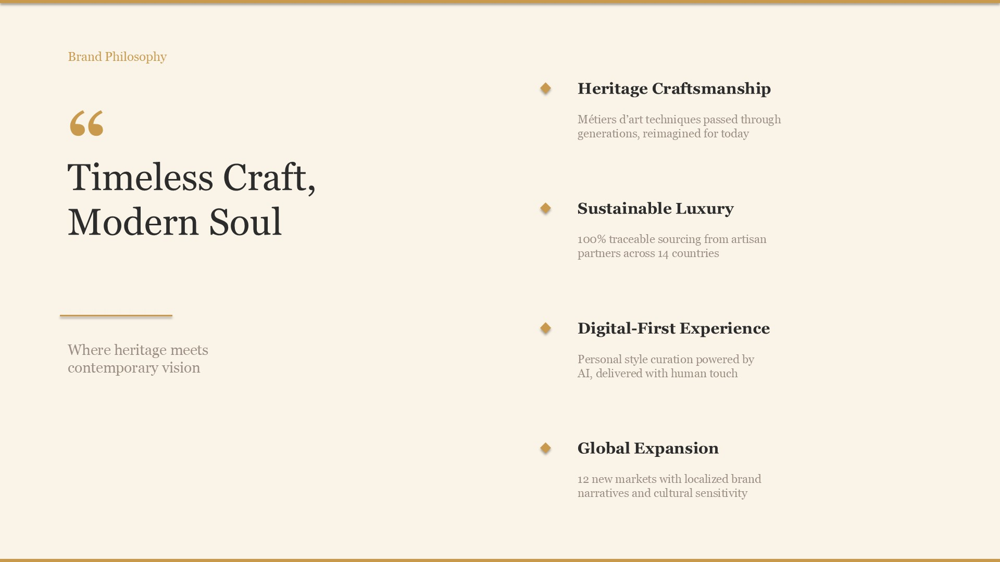
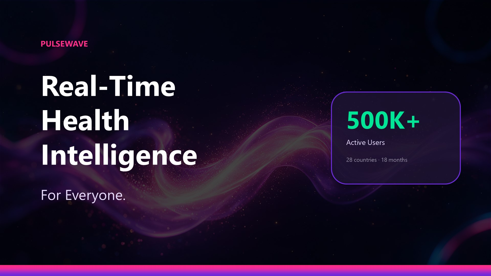
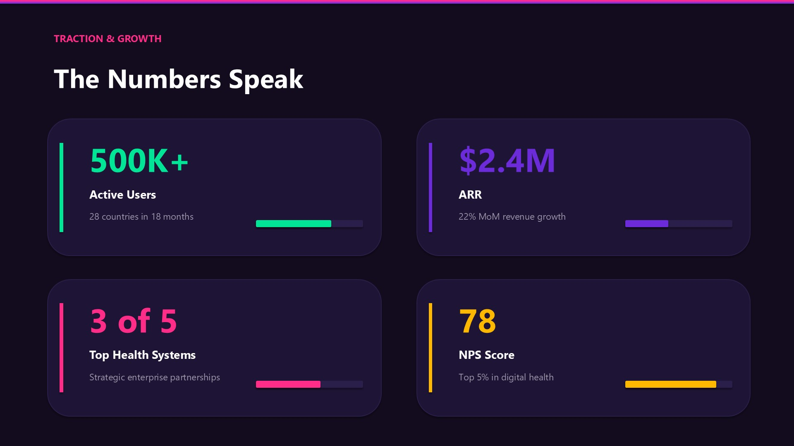
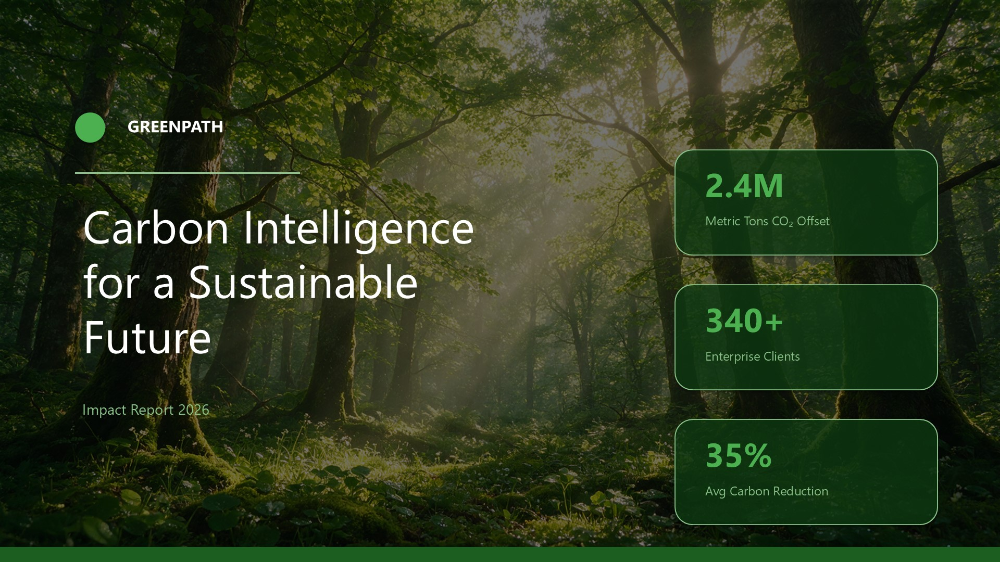
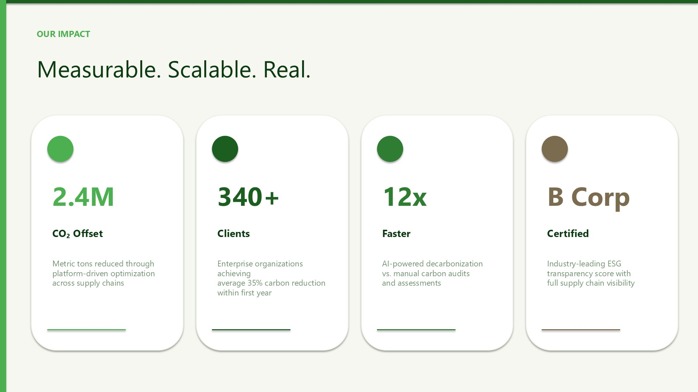

<div align="center">

# PPT Design Skill

> PPT generation skill for OpenCode / Claude Code / Codex / Cursor

**One prompt → professional .pptx · 40,000+ styles · AI images · Fully editable**

[](LICENSE)
[](https://python.org)
[](https://pypi.org/project/python-pptx/)

Type in your AI coding tool: `Generate a dark cyberpunk investor pitch PPT` → skill auto-loads → outputs .pptx

| FreeStyle | Build Script | VI Build |
|:---:|:---:|:---:|
| One-liner generation | **Pixel-perfect + proposals** | **Enterprise template compliance** |
| 30-second quick draft | **python-pptx precise control** | **Preserve framework pages + build_helpers** |

[中文](../README.md) | [Usage Guide](usage-guide.md) | English

</div>

---

## ✨ Showcase

> 5 styles, 5 scenarios — each with cover + content page, AI images by Seedream

### 🏢 Professional Modern — Enterprise Investor Pitch

 

*Navy blue corporate · Gold accents · Left sidebar navigation · 2×2 metric cards*

### 🌌 Dark Tech — AI Product Launch

 

*Cyberpunk dark · Neon blue/purple/pink · Consolas monospace · 3-column feature cards*

### 🏛️ Warm Elegant — Luxury Brand Strategy

 

*Golden marble · Georgia serif · Centered editorial layout · Diamond bullet points*

### 🚀 Vibrant Startup — Fundraising Pitch Deck

 

*Purple-pink gradient · Segoe UI · Progress bar metrics · Semi-transparent stat pills*

### 🌿 Nature Calm — Sustainability Impact Report

 

*Forest green · Circle accents · 4-column impact cards · Narrow left sidebar*

---

## 🚀 Quick Start

### Install as Skill (Recommended)

```bash
git clone https://github.com/sunchaokun/PPT-Design-Skill.git
cd PPT-Design-Skill

# One-click install — auto-detect platform + install skill + deps
python install.py                     # Auto-detect
python install.py --platform opencode # Specify platform
```

Supports 13 platforms: OpenCode · Claude Code · Codex · Cursor · Windsurf · Roo Code · Gemini · Trae · Continue · Droid · KiloCode · Augment · Copilot

### Use as Python Package

```bash
pip install .
ppt-design "AI startup investor pitch" --style "dark cyberpunk"
```

### Use in AI Coding Tools

After installation, type in OpenCode / Claude Code / Codex:

```
Generate a dark cyberpunk investor pitch PPT
```

The AI will auto-load the skill and generate a .pptx file.

### FreeStyle — Generate from a Sentence

```bash
ppt-design "AI startup investor pitch"
ppt-design "fintech pitch" --style "warm fintech"
ppt-design "product launch" --style "dark cyberpunk tech"
ppt-design "ESG report" --style "calm nature"

# AI images + animation
ppt-design "investor pitch" --style "dark cyberpunk" \
  --fetch-images --llm-provider seedream --llm-api-key $ARK_API_KEY \
  --motion 7 --density 6
```

### VI Build — Enterprise Template Compliance

```bash
python -m ppt_pro_max.analyze_template template.pptx > analysis.txt
# Feed analysis.txt to LLM to generate build.py, then:
python build.py
```

### Build Script — Per-Page Precision

```python
from ppt_pro_max.build_helpers import *

prs = Presentation()
s = add_slide(prs)
hero_slide(s, 'Title', 'Subtitle', C=C, typo=TYPOGRAPHY['mckinsey'])
# ... precise control over every element: x, y, w, h, font, size, color
prs.save("output/presentation.pptx")
```

---

## 🔥 Features

| Feature | Description |
|---------|-------------|
| **Triple-Mode Engine** | FreeStyle rapid generation + Build Script per-page precision + VI Build enterprise compliance |
| **40,000+ Style Combos** | 30 palettes × 25 fonts × 15 decorations × 12 layouts, natural language `--style` |
| **AI Image Engines** | Seedream / GPT Image / DALL-E / Gemini / Wanx — 5 engines + Kimi enhancement |
| **python-pptx Direct** | Fully editable .pptx, 356x faster than HTML→screenshot |
| **10 Diagram Types** | Flowchart / Funnel / Timeline / SWOT / Matrix / Cycle / Table / Hierarchy / Pyramid / Venn |
| **Animation System** | 12 transitions + 10 entrance + 8 exit + 8 emphasis + Morph, motion 1-10 mapping |
| **CJK Fonts** | 12 CJK font pairings with auto-fallback |
| **5,500+ Component Library** | SmartArt/GroupShape templates, SQLite-indexed, match by category/node count |

---

## 🏗️ Triple-Mode Architecture

| | **FreeStyle** | **Build Script** | **VI Build** |
|---|---|---|---|
| **Use case** | Quick exploration, prototyping | Delivery-grade precision | Enterprise VI compliance |
| **Trigger** | Default | `"build mode"` / `"pixel-perfect"` | Provide template.pptx |
| **Content** | AI auto-generates | Hand-written build.py | LLM reads template → build.py |
| **Quality** | ★★★ | ★★★★★ | ★★★★★ |
| **Proposals** | 3 style previews | 3 structurally-different proposals | 3 layout proposals (same VI Token) |

> **Recommended workflow**: FreeStyle prototype → Build / VI Build for precision delivery

---

## 🎨 Design System

**Natural language style** — describe and generate. Natural-language styles go through **mood detection + ui-ux-pro-max database** and, without a seed, select palette/fonts/decoration **randomly per run** (not a fixed mapping). For deterministic output use preset names (`dark-tech`/`professional`/`warm-elegant`) or explicit `--style-seed`:

```bash
ppt-design "investor pitch" --style "warm fintech"       # mood=[warm,fintech]; palette/fonts via ux database
ppt-design "product launch" --style "dark cyberpunk"      # mood=[dark,neon] → neon-lines decoration, dark neon colors
ppt-design "brand strategy" --style "elegant luxury"      # mood=[elegant,luxury] → rose-toned ux colors (not gold)
ppt-design "山水诗" --style "水墨"                        # mood=[ink-wash] → paper-toned + seal-stamp decoration

# Deterministic: preset / explicit atoms / fixed seed
ppt-design "product launch" --style "dark-tech"           # fixed → cyber-neon palette + tech-mono + neon-lines
ppt-design "investor pitch" --palette ocean-blue --fonts clean-corporate --decoration accent-bar
ppt-design "investor pitch" --style "warm fintech" --style-seed 42
```

**41 mood keywords**: professional, tech, dark, warm, elegant, luxury, vibrant, startup, nature, calm, minimal, bold, fresh, industrial, fintech, health, education, sustainability, creative, mckinsey, consulting, pastel, retro, government, legal, pharma, realestate, automotive, aviation, energy, telecom, logistics, ink-wash, zen, sci, neon ...

<details>
<summary><strong>📐 Design Atoms Detail</strong></summary>

| Atom | Count | Examples |
|------|-------|----------|
| 🎨 Color Palettes | 30 | ocean-blue, cyber-neon, golden-luxury, ink-wash, zen-minimal, sci-paper... |
| ✏️ Font Pairs | 25 | modern-sans, serif-editorial, tech-mono, ink-wash-serif, sci-serif, tech-display... |
| 🖌️ Decorations | 15 | accent-bar, neon-lines, gold-trim, brush-stroke, seal-stamp, neon-glow, sci-grid, glass-panel... |
| 📐 Layout Variants | 12 | standard, centered, sidebar-left, grid-2x2, scroll, ink-wash, sci-dense, hero-image... |

**30 × 25 × 15 × 12 = 135,000 combinations**

With ui-ux-pro-max (192 palettes · 84 styles · 74 fonts · 161 anti-patterns): 200,000+

</details>

<details>
<summary><strong>🖼️ Image Engines</strong></summary>

| Engine | Type | CLI | Default Model |
|--------|------|-----|---------------|
| `placeholder` | Gradient placeholder | Default | — |
| `search` | Unsplash / Pexels | `--image-mode search` | — |
| `seedream` | AI generate | `--llm-provider seedream` | `doubao-seedream-5-0-260128` |
| `gpt-image` | AI generate | `--llm-provider gpt-image` | `gpt-image-1` |
| `dalle` | AI generate | `--llm-provider dalle` | `dall-e-3` |
| `gemini` | AI generate | `--llm-provider gemini` | `gemini-2.5-flash-image` |
| `wanx` | AI generate | `--llm-provider wanx` | `wanx-v1` |
| `kimi` | Enhanced search | `--llm-provider kimi` | `kimi-k2-0711-preview` |

All AI engines include **cache-first** — same image never generated twice.

</details>

<details>
<summary><strong>🏆 28 Design Quality Upgrades</strong></summary>

**Tier 1 — Visual Foundations (10)**: Layout Engine · Typography Scale · OKLCH Color Depth · Gradient Overlay · 5-Level Shadow Elevation · Smart Brand Strip · Image Color Grading · Card Upgrade · Dark Mode Fix · Code Block Redesign

**Tier 2 — Typography Enhancements (6)**: CJK Font Pairing · Adaptive Margins · Badge System · Section Dividers · Decoration Renderer · Layout Variant Consumption

**Tier 3 — Advanced Visual (7)**: Noise Texture · Progress Bar · Corner Radius System · Gradient Lines · Image Masking · Two-Column Bullets · 4 Hero Patterns

</details>

<details>
<summary><strong>🌟 Advanced Design Effects (7 Modules)</strong></summary>

| Module | Capabilities | API |
|--------|-------------|-----|
| **AD-P1 Text Effects** | Gradient (10 presets) · outline · shadow · glow · 3D · alpha · vertical · rotation · letter spacing | `gradient_text()` / `vertical_text()` / `seal_stamp()` |
| **AD-P2 Image Effects** | Shape crop (circle/hexagon/diamond) · duotone · grayscale · 22 artistic effects · 7 Pillow filters | `circle_image()` / `duotone_image()` / `artistic_image()` |
| **AD-P3 Style Expansion** | +5 palettes · +5 fonts (KaiTi/FangSong/Orbitron) · +5 decorations · +4 layouts · +5 moods | `--style "水墨"` / `--style "霓虹"` |
| **AD-P4 3D & Patterns** | 3D shapes (extrusion+bevel+material) · 31 pattern fills · semi-transparent panel | `shape_3d()` / `pattern_fill()` / `frosted_panel()` |
| **AD-P5 Animation** | Morph transition · 8 exit animations · 8 emphasis animations | `exit_animation()` / `emphasis_animation()` |
| **AD-P6 Decorations** | Brush divider · seal stamp · scroll frame · neon border · grid background · glass panel · ink splash | `brush_divider()` / `neon_border()` / `ink_splash()` |
| **AD-P7 Mode Integration** | mood → text/image effect auto-mapping · `compose()` returns effect fields | `--style "水墨"` auto-triggers |

**Code example**:

```python
from ppt_pro_max.build_helpers import *

prs = Presentation()
s = add_slide(prs)
gradient_text(s, 1.0, 1.0, 8.0, 1.5, "Title", preset='gold-shine', font_size=44)
circle_image(s, 6.5, 3.0, 1.0, "photo.jpg")
shape_3d(s, 1.0, 3.5, 3.0, 2.0, depth=15.0, material='metal')
frosted_panel(s, 5.0, 3.0, 6.0, 3.0, tint='#1A1A3A', alpha=20)
brush_divider(s, 1.0, 5.0, 6.0, color='#2C2C2C')
seal_stamp(s, 11.0, 5.5, 0.8, "印", rotation=-15)
prs.save("output.pptx")
```

</details>

---

## License

MIT
