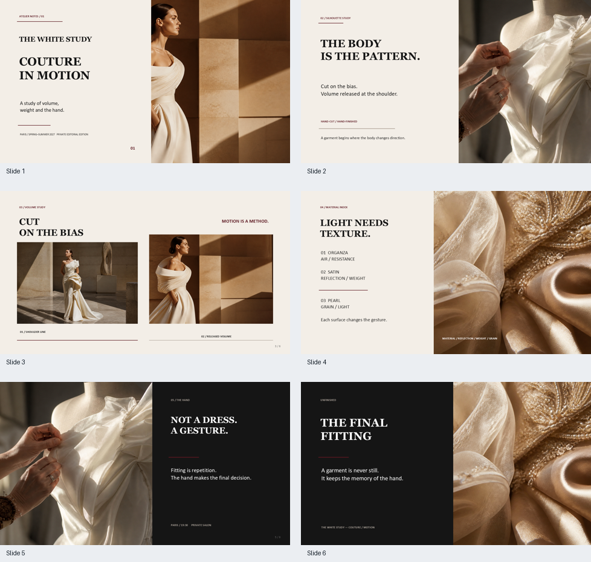
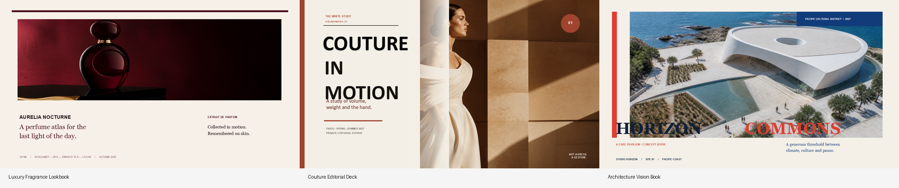

# PPT Design Skill 真实案例

这里的五个案例不是为了测试 API 而临时拼出的示例，而是完整的、可打开
的 PowerPoint 设计案例，用于说明 skill 应该追求的视觉完成度和页面叙事
能力。案例覆盖技术系统、产业研究、品牌编辑、高级定制和建筑愿景，既有
来自 `pptx-designer` 的正式示例，也有本技能的评估项目。

## 视觉总览

在线浏览全部案例：
[PPT Design Skill 案例画廊](https://sunchaokun.github.io/PPT-Design-Skill/)

### 在线浏览完整案例

每个案例都可以进入在线查看器，浏览全部页面并下载 PPTX、PDF：

[打开 PPT Design Skill 案例画廊](https://sunchaokun.github.io/PPT-Design-Skill/)

### 页面预览

<p align="center">
  
</p>

这组案例体现了本 Skill 对高完成度视觉设计的要求：视觉方向先行，页面
结构服务于叙事，图片、标题、编号和材质标签共同建立版面节奏。



## 案例一：奢华香水画册

[luxury_fragrance_lookbook.pptx](output/luxury_fragrance_lookbook.pptx)

香水编辑型画册，采用暗色、克制、具有杂志感的视觉方向。四页分别承担
封面叙事、原料图谱、肌肤仪式和产品收束功能。

重点观察：

- 图片只承担氛围和材质表达；文字、色块和版式保持原生可编辑。
- 页面不是重复的卡片模板，而是围绕编辑型叙事改变结构。
- 产品信息、材质来源和情绪文案被组织为视觉叙事，而不是堆砌卖点。

## 案例二：高级定制编辑型演示

[couture_editorial_deck.pptx](output/couture_editorial_deck.pptx)

高级定制时装编辑型演示，采用解构式版面、留白、图片与文字的错位关系，
页面依次呈现宣言、轮廓研究、材料索引和最终试装。

重点观察：

- 使用非对称关系表达“运动、体积和手工感”。
- 图片和文字不是简单的左右分栏，而是共同构成版面节奏。
- 细节标签、编号和材料索引承担信息结构，装饰不替代内容。

## 案例三：建筑愿景书

[architecture_vision_book.pptx](output/architecture_vision_book.pptx)

建筑愿景书 / 竞赛型视觉叙事案例，强调概念、空间、材质和最终邀请之间
的递进关系。

重点观察：

- 使用建筑摄影作为空间情绪和尺度感来源。
- 页面从概念表达逐步过渡到空间原则和最终邀请。
- 图像承担氛围层作用，重要的文字和结构信息仍然可编辑。

## 运行与检查

这五个案例已经包含生成后的 `.pptx`，不应把它们当成只验证代码能否运行的
简单测试。交付前应重新执行：

```powershell
python skill/scripts/inspect_pptx.py examples/output/luxury_fragrance_lookbook.pptx --pretty
python skill/scripts/inspect_pptx.py examples/output/couture_editorial_deck.pptx --pretty
python skill/scripts/inspect_pptx.py examples/output/architecture_vision_book.pptx --pretty
```

然后分别执行 `skill/scripts/render_pptx.ps1`，生成 PDF 和 PNG，并由 LLM
逐页检查：构图、文字可读性、图片裁切、视觉节奏、页间一致性和可编辑性。

案例源代码和图片资产维护在 `pptx-designer` 仓库的 examples 目录中；本仓库
保留这里的 PPTX 产物作为 skill 视觉基准，不重新复制一份引擎源码。
